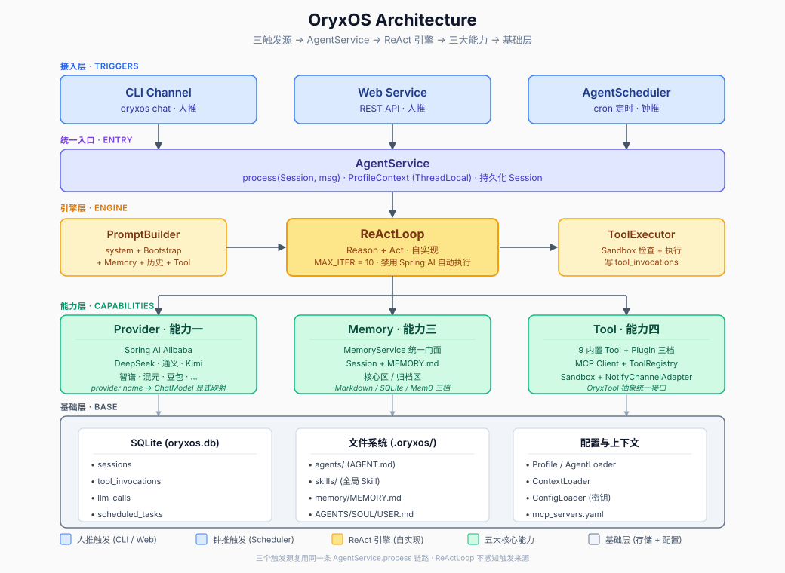

# OryxOS


> **企业私有部署的 Agent 操作系统：你用一句自然语言发布一个任务 → 底座把它拆解 → 组织一支 Agent 团队 → 多个 Agent 分工协作 → 交付一个结果。** 让每一家公司，都能用自然语言跑起来自己的 Agent。

OryxOS 是开源的 **Agent Harness OS**（Agent 运行骨架）——套在模型外面、把模型变成能干活的 Agent 的那层脚手架。**北极星公式：自然语言(md) + Memory + Tool + MCP(Connector) + Skill + 知识库 + Notify = 一个 Agent。** 一个目录定义一个 Agent，一个底座运行一群 Agent，私有部署，数据不出域。覆盖模型接入、推理循环、记忆、工具调用、对外服务五大核心能力。

---

## 为什么需要 OryxOS

每家公司都有该交给 Agent 的活，但 Agent 大多还停在 demo，卡在四道门槛上：

1. **定义一个 Agent 要写代码** — 最懂业务的人反而做不了
2. **云平台要把数据拿走** — 合规过不去
3. **执行是黑盒** — 没审计、没白名单、没人审批，企业不敢上生产
4. **跑一个容易、跑一群难** — 没有人把「一群 Agent 的操作系统」这一层交给你

OryxOS 一次拆掉这四道门槛：自然语言定义、私有部署、全链路审计加沙箱、以及为一整队 Agent 准备的生命周期与治理。

更深一层的判断是：**让 Agent 在生产环境可靠工作，瓶颈通常不在模型本身，而在 Agent 的运行环境。** OryxOS 做的不是又一个 Agent，而是这个让一群 Agent 可靠运行和协同的底座本身。

---

## Agent Harness OS

Agent runtime 是让单个 Agent 跑起来的执行内核，负责调用模型、执行工具、管理上下文、控制推理循环。Agent Harness OS 在 runtime 之上，管理的是一群 Agent：多个 Agent 的生命周期、统一的对外渠道与对内接入、统一的记忆、多租户与治理，以及分布式形态下的跨节点协作。

**runtime 让一个 Agent 跑起来，Agent Harness OS 让一群 Agent 被运行和管理起来。** OryxOS 是后者。

---

## 架构



OryxOS 是 Spring Boot 单体应用（JDK 21 + 虚拟线程），三个触发入口（CLI / Web Service / AgentScheduler 定时任务）汇入同一个 `AgentService`，由自实现的 **ReAct 循环** 驱动五大核心能力。

| 能力 | 说明 |
|------|------|
| **对接 LLM** | Provider 抽象 + 显式映射，Agent 不感知具体厂商，运行时切换不锁定 |
| **ReAct 循环** | Agent 大脑，自实现约数十行 Java，虚拟线程高并发，机制完全可控 |
| **Memory 记忆** | MemoryService 统一门面，核心区全量注入 + 归档区关键词检索，三档后端可切换 |
| **Tool 工具** | 9 个内置 Tool + Plugin 三档接入（零代码 MCP / 自写 MCP / @Tool Java Bean），Sandbox 白名单兜底 |
| **Web Service** | 11 个 REST 端点（10 核心 + 会话列表只读扩展），所有能力通过 HTTP API 暴露，任何语言可集成 |

> **审计 day one**：`llm_calls`、`tool_invocations` 从第一版起写入 SQLite——每一笔模型调用、每一次工具执行都留痕。

---

## 管理平台

`serve` 启动后，一个内嵌的只读管理台随服务一起托管在 `/admin`（无需额外进程）：

- **总览** — OryxOS 定位与五大能力预览
- **Agent** — 当前注册的全部 Agent（一个目录 = 一个 Agent）
- **会话列表** — 所有对话会话（CLI / Web / 定时任务共享同一存储）
- **Tool 列表** — 已注册工具（内置 + MCP）
- **长期记忆** — 记忆全文（运维视图，不截断）
- **Sandbox 白名单** — 安全边界配置视图（接入中）
- **Provider 列表** — 各 LLM Provider 实时连通状态
- **运行状态** — 版本信息与系统状态

配合 `swagger-ui`（`/swagger-ui.html`）的 OpenAPI 文档，全部 11 个端点一目了然。

---

## 快速开始

### 环境要求

- **JDK 21+**、**Maven 3.9+**
- **Node.js 20+**（仅构建管理台前端时需要；产物随 fat JAR 分发）
- Linux 主流发行版（Ubuntu 22.04+ / CentOS 8+ / Debian 11+）

### 一键构建

```bash
git clone git@github.com:CodeMoss24/oryxos.git
cd oryxos
mvn clean package            # 一条命令出全量 fat JAR（含管理台前端自动构建）
```

- 产物：`oryxos-boot/target/oryxos-boot-1.0.0-SNAPSHOT.jar`
- 纯后端迭代可跳过前端构建：`mvn clean package -Dfrontend.skip=true`

### 一键启动（Server + 管理台）

```bash
export DEEPSEEK_API_KEY=sk-xxx    # 只需一个 Provider 密钥即可启动
java -jar oryxos-boot/target/oryxos-boot-1.0.0-SNAPSHOT.jar serve
```

也可以用仓库根目录的启停脚本（后台运行 + 日志落 `.oryxos/logs/server.log`，pid 记 `.oryxos/server.pid`）：

```bash
./start.sh              # 默认 8080；端口被占时 ./start.sh 8081
./stop.sh               # 停止
```

启动后同一进程同时提供：

| 入口 | 地址 |
|------|------|
| REST API | `http://localhost:8080/api/v1` |
| 管理平台 | `http://localhost:8080/admin` |
| OpenAPI 文档 | `http://localhost:8080/swagger-ui.html` |

### 管理台开发模式（热更新）

前端改 UI 时用开发模式：Vite dev server 从源码实时编译，改 `App.vue`/样式保存后浏览器自动刷新，不需要每次 `mvn package`。

**前置条件**：后端 `serve` 先起（dev 只跑前端，`/api` 请求经代理转发到后端）：

```bash
# 终端 1：起后端（API + 数据源）
java -jar oryxos-boot/target/oryxos-boot-1.0.0-SNAPSHOT.jar serve

# 终端 2：起前端开发模式
cd oryxos-web/src/main/frontend
npm ci
npm run dev                   # http://localhost:5173/admin/，改代码即时刷新
```

**端口被占怎么办**：默认代理指向 `http://localhost:8080`；如果 8080 被其他程序占用（如 IDE 的 node 服务），把后端起在别的端口并用环境变量覆盖代理目标：

```bash
java -jar oryxos-boot/target/oryxos-boot-1.0.0-SNAPSHOT.jar serve --server.port=8081
cd oryxos-web/src/main/frontend
ORYXOS_API_PROXY=http://localhost:8081 npm run dev
```

> 提示：IDE（VS Code / Trae 等）可能自动对 5173、8081 做端口转发并改写浏览器地址，属正常现象，不影响使用。开发模式下改完的源码仍需 `mvn package` 才会进入 fat JAR（生产形态由 `frontend-maven-plugin` 自动构建）。

### 初始化工作区

```bash
java -jar oryxos-boot/target/oryxos-boot-1.0.0-SNAPSHOT.jar init
```

创建 `.oryxos/` 工作区：

```
.oryxos/
├── agents/            # 每个子目录 = 一个 Agent（AGENT.md + 可选 skills/scripts/）
├── skills/            # 全局 Skill 库
├── output/            # Agent 产出物
├── memory/
│   └── MEMORY.md      # 长期记忆（## 核心记忆 / ## 归档记忆）
├── sessions/          # 会话历史
├── logs/              # 结构化日志
├── mcp_servers.yaml   # MCP 配置
├── AGENTS.md          # Bootstrap：项目级 agent 行为说明
├── SOUL.md            # Bootstrap：默认 agent 人格
├── USER.md            # Bootstrap：用户偏好
└── oryxos.db          # SQLite（会话 / 审计）
```

### 定义第一个 Agent

`.oryxos/agents/daily-weather/AGENT.md`（frontmatter 即 Agent 配置，正文即任务指令）：

```markdown
---
name: daily-weather
description: 每天早上查天气并推送穿搭建议
provider:
  name: deepseek
  model: deepseek-chat
tools: [http_get, notify]
notify_channels:
  - type: webhook
    url: https://qyapi.weixin.qq.com/cgi-bin/webhook/send?key=xxx
schedules:
  - cron: "0 0 8 * * ?"
    zone: Asia/Shanghai
    message: 查北京今天的天气并给我穿搭建议，推送出来
---

查天气，生成穿搭建议，通过 notify 推送。
```

### 三种运行模式

```bash
java -jar oryxos-boot/target/oryxos-boot-1.0.0-SNAPSHOT.jar chat --profile daily-weather   # 交互对话
java -jar oryxos-boot/target/oryxos-boot-1.0.0-SNAPSHOT.jar serve                          # REST API + 管理台
java -jar oryxos-boot/target/oryxos-boot-1.0.0-SNAPSHOT.jar gateway                        # 多渠道守护进程
```

### 第 27 节：mock provider（无 key 跑通全链路）

`mock` 是内置的独立 provider：不联网、不需要任何 API key，按两轮脚本驱动一次确定性的 ReAct——

1. 第一轮把用户消息里"记住：…"的事实抽出来，请求一次 `save_memory`（真实写入 MEMORY.md）；
2. 第二轮直接返回最终答复"好的，已记住：…"。

只有模型是假的，ReActLoop / ToolExecutor / Memory / SQLite 审计 / Session 持久化全部走真实路径。用它验证全链路不需要任何密钥：

```markdown
<!-- .oryxos/agents/mock-agent/AGENT.md -->
---
name: mock-agent
description: 记忆测试 agent
provider:
  name: mock
  model: mock
tools: [save_memory, recall_memory]
---
你是记忆助手。用户说"记住：…"时用 save_memory 工具记住；需要回忆时用 recall_memory。
```

### 人推验证（第 27 节对账的三种触发源之"人推"）

```bash
# 1) REST 无状态调用（serve 启动后）
curl -s -X POST localhost:8080/api/v1/agents/mock-agent/invoke \
  -H 'Content-Type: application/json' \
  -d '{"content":"记住:我住在上海","user_id":"alice"}'
# → {"reply":"好的，已记住：我住在上海",...}

# 2) 会话列表（第 27 节升级为摘要 DTO，可 ?status= 过滤）
curl -s localhost:8080/api/v1/sessions
# → 含 web:alice:mock-agent 的 sessionId / profileName / messageCount

# 3) 审计落库（会话、工具调用、LLM 调用三表都能查到）
curl -s localhost:8080/api/v1/sessions/web:alice:mock-agent   # 4 条消息：user/assistant/tool/assistant
sqlite3 .oryxos/oryxos.db "select * from llm_calls where session_id='web:alice:mock-agent';"
sqlite3 .oryxos/oryxos.db "select * from tool_invocations where session_id='web:alice:mock-agent';"
```

---

## 测试

测试分两层:**单测/切片测试**(`*Test` 后缀,`mvn clean verify` 自动跑)与**集成测试**(`*IT` 后缀,surefire 默认排除,需手动运行——IT 要起真 Spring 上下文,涉及真 key / 真网络,留给人推验证)。

### 全量门禁

```bash
mvn clean verify
```

跑什么:所有单测 + 静态检查(P3C / SpotBugs / FindSecBugs / PMD),**集成测试不在其中**。

### 手动跑集成测试

三个 IT 类都在 `oryxos-boot` 模块。命令**必须带 `-am`**(also-make):单模块不带 `-am` 会复用 `~/.m2` 里的旧 jar,报 `NoClassDefFoundError: OryxOsRuntime`。

```bash
# 单独跑一个
mvn test -pl oryxos-boot -am \
  -Dtest='HumanTriggerFlowIT' \
  -Dsurefire.failIfNoSpecifiedTests=false

# 一次跑多个
mvn test -pl oryxos-boot -am \
  -Dtest='HumanTriggerFlowIT,WebSmokeIT,ProviderSmokeIT' \
  -Dsurefire.failIfNoSpecifiedTests=false
```

| 参数/环境 | 作用 |
|-----------|------|
| `-am` | 连带构建依赖模块,绕开 m2 stale-jar 陷阱 |
| `-Dsurefire.failIfNoSpecifiedTests=false` | 允许没有匹配测试的模块不报错 |
| `DEEPSEEK_API_KEY` | 设置了,真模型用例真实运行;未设置,那些用例 `assumeTrue` 跳过,失败路径用例恒跑(不依赖模型) |
| 报告位置 | 各模块 `target/surefire-reports/` |

现有集成测试:

| 类 | 覆盖 |
|----|------|
| `HumanTriggerFlowIT` | 人推全流程:真模型天气查询(http_get → wttr.in)+ provider 未配置 / 沙箱越界 / 工具抛异常三条确定性失败路径,成败都落审计 |
| `WebSmokeIT` | Web 层冒烟(健康检查、静态资源) |
| `ProviderSmokeIT` | Provider 连通探活 |

### 手工过一遍(不写代码,验证真实行为)

```bash
# 改了代码/前端后必须先重新构建再重启,否则测的是旧代码(管理台看不到新数据即此坑)
mvn package -DskipTests
java -jar oryxos-boot/target/oryxos-boot-1.0.0-SNAPSHOT.jar serve --server.port=8080
```

启动后按链路逐项验证(具体 curl 见上文「人推验证」):`/api/v1/health`、`/api/v1/profiles` → invoke 人推 → `/api/v1/sessions` 会话列表 → `sqlite3 .oryxos/oryxos.db` 查 `llm_calls` / `tool_invocations` 审计两表 → 浏览器开 `http://localhost:8080/admin/` 核对管理台展示层。

---

## 模块结构

OryxOS 是 Maven 多模块项目，9 个模块：

| 模块 | 职责 |
|------|------|
| `oryxos-core` | 核心抽象：`OryxTool`、`ReActLoop`、`PromptBuilder`、`ToolExecutor`、`AgentService`、`AgentScheduler` |
| `oryxos-provider` | ProviderService、Function Calling 适配、显式映射、连通探活 |
| `oryxos-memory` | MemoryService 统一门面、三档后端（Markdown/SQLite/Mem0）、MemoryTools |
| `oryxos-tool` | 内置 Tool、MCP Client、ToolRegistry、Sandbox、NotifyChannelAdapter |
| `oryxos-channel-cli` | CliChannel、`oryxos chat` |
| `oryxos-web` | WebServer、6 个 ApiController、GlobalExceptionHandler、管理台前端 |
| `oryxos-storage` | SQLite 持久化、各 Repository |
| `oryxos-cli` | Picocli 主入口、12 个子命令 |
| `oryxos-boot` | Spring Boot 启动模块 |

---

## 设计原则

- **底座优先于 Agent** — 最重要的交付不是某个强大的 Agent，而是让任意 Agent 都能可靠运行的环境
- **自实现核心，可控优先** — 核心推理循环自己实现，底层模型协议适配复用成熟库，不重复造轮子
- **配置即 Agent** — 一个 Agent 由一份配置定义，而不是由代码写出
- **对接开放标准** — 工具用 MCP、协作用 A2A、技能用开放格式，与生态协同
- **无状态实例，状态外置** — 从单机平滑走向分布式的前提
- **安全是地基不是补丁** — 工具来源受控、最小权限、强制沙箱、凭证不落地、全链路可审计，安全从第一天就在架构里
- **分阶段克制** — 当前只做运行时内核的最小完备集，治理与重型分布式基础设施留到后续，每次架构升级都用真实使用数据证明其必要性

---

## 路线图

我们的开发理念是：**慢就是快，克制且聚焦。** 先把单机的运行时内核做扎实，让一个节点上运行和管理一群 Agent 这件事真正可用、有人用，再在它之上逐步生长出分布式能力。

- **阶段一（当前）单机运行时内核**
  - 五大核心能力跑通：配置即 Agent、多 Agent 并存、REST API 接入、对接 MCP
  - 把单节点运行和管理一群 Agent 做到可用
- **阶段二（规划）底座分布式**
  - 节点无状态化、状态外置、多副本部署
  - 支撑更大规模与高可用
- **阶段三（愿景）跨节点 Agent 协作**
  - 引入 Agent 通信底座，对接 A2A
  - 让多节点上的 Agent 跨节点发现、委托、可靠异步协同
- **横向能力（伴随各阶段逐步补齐）**
  - 多租户、SSO、完整审计、工具策略、可观测、Web 管理

---

## 文档

| 文档 | 内容 |
|------|------|
| [`docs/oryxos.md`](docs/oryxos.md) | 项目总览 |
| [`docs/IndustryResearch.md`](docs/IndustryResearch.md) | 业界格局与定位 |
| [`docs/DemandAnalysis.md`](docs/DemandAnalysis.md) | 需求文档 |
| [`docs/TechnicalSolution.md`](docs/TechnicalSolution.md) | 技术方案（权威） |
| [`docs/AiProgrammingGuide.md`](docs/AiProgrammingGuide.md) | AI 编程实施指引 |
| [`CLAUDE.md`](CLAUDE.md) | AI Agent 工作指引 |

---

## 项目信息

- **语言**：Java（JDK 21）
- **协议**：Apache 2.0
- **生态**：oryx-labs
- **长期目标**：走进 Apache 基金会，努力成为 Apache 顶级项目

---

## License
